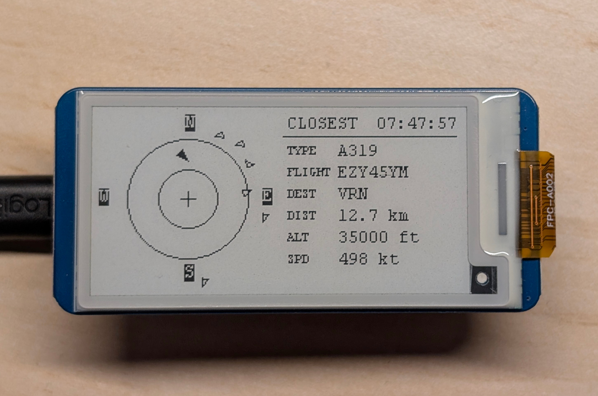

# PicoADSB

Live ADS-B aircraft radar on a Raspberry Pi Pico W and a 2.13" e-Paper display.

Every 30 seconds the device queries the free [adsb.lol](https://adsb.lol) API for
aircraft flying within range of your position and renders them on screen:



- **Left half** — a radar view centered on your position. Each aircraft is a
  triangle oriented along its heading; the closest one is drawn filled.
- **Right half** — details of the closest aircraft: type (decoded to its usual
  name, e.g. `A339` → `A330-900neo`), flight number, destination airport,
  distance, altitude and ground speed, plus the time of the last update in the
  top-right corner.

## Hardware

| Item | Notes |
|---|---|
| Raspberry Pi Pico W | RP2040 + WiFi |
| [Waveshare Pico-ePaper 2.13 (V4)](https://www.waveshare.com/wiki/Pico-ePaper-2.13) | Plugs directly onto the Pico W header |

No other hardware is required. The display is bistable: between refreshes both
the panel and the radio are put into low-power states.

## Building

### Prerequisites

- CMake ≥ 3.13
- ARM embedded toolchain (`arm-none-eabi-gcc`)
- The [pico-sdk](https://github.com/raspberrypi/pico-sdk) (with submodules)
- `picotool` for flashing (optional but convenient)

### Steps

1. Clone this repository.

2. Create your private config with WiFi credentials:

   ```sh
   cp src/config.local.h.example src/config.local.h
   # then edit src/config.local.h
   ```

3. Set your home position and preferences in `src/config.h`:

   | Option | Default | Description |
   |---|---|---|
   | `OBSERVER_LAT` / `OBSERVER_LON` | Paris area | Your position, decimal degrees |
   | `RANGE_KM` | 25 | Radar radius in km |
   | `REFRESH_SEC` | 30 | Seconds between updates |
   | `CLEAR_EVERY_N` | 10 | Full panel clear interval (fights e-paper ghosting) |
   | `HTTP_MAX_BODY` | 16384 | Max JSON response size |

4. Build:

   ```sh
   cmake -B build -S . -DPICO_BOARD=pico_w -DPICO_SDK_PATH=/path/to/pico-sdk
   cmake --build build --target picoadsb -j
   ```

   The firmware is produced as `build/picoadsb.uf2`.

## Flashing

With the board connected by USB:

```sh
picotool load -f -x build/picoadsb.uf2
```

Or manually: hold BOOTSEL while plugging in the Pico, then copy
`build/picoadsb.uf2` onto the mounted `RPI-RP2` drive.

## Usage

Once flashed the device is fully autonomous:

1. It connects to your WiFi network (`NO WIFI` is shown if it fails).
2. It fetches nearby aircraft from adsb.lol every `REFRESH_SEC` seconds.
3. The screen shows the radar and closest-aircraft panel; the clock in the
   top-right shows the timestamp of the last successful update
   (`--:--:--` until the first fetch succeeds).
4. If a fetch fails, the last frame is kept and retried after the next period.

To watch logs, connect to the serial console:

```sh
minicom -b 115200 -o -D /dev/ttyACM0
```

## Data source

Aircraft data comes from the free community-run API
[adsb.lol](https://adsb.lol) — no API key needed. Destination lookup uses their
route database. Many thanks to the adsb.lol feeder community.
